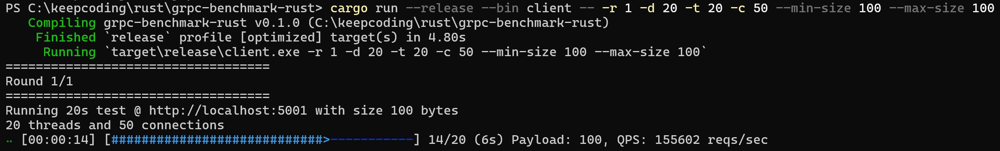
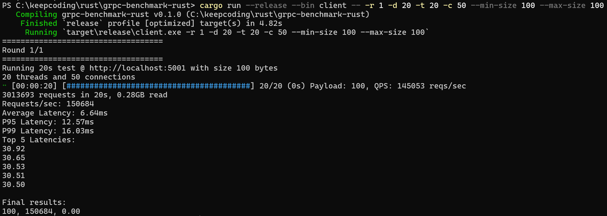

# gRPC Benchmark Tool in Rust

This is a high-performance gRPC benchmark tool written in Rust using Tonic. It provides both a server and client for benchmarking gRPC performance with various payload sizes and concurrency levels.

## Features

- **High-performance gRPC server** using Tonic
- **Benchmark client** with configurable parameters
- **Multiple RPC types**: Unary, Server Streaming, and Sleep operations
- **Configurable payload sizes** from 10 bytes to 1MB
- **Concurrent connection testing** with multiple threads
- **Detailed statistics** including latency percentiles and throughput
- **Progress tracking** with real-time QPS display

## Example Output

```
===================================
Round 1/3
===================================
Running 20s test @ http://localhost:5001 with size 10 bytes
5 threads and 80 connections
[████████████████████████████████████████] 20/20 (0s remaining)
1604002 requests in 20s, 0.01GB read
Requests/sec: 80200
Average Latency: 4.99ms
P95 Latency: 8.45ms
P99 Latency: 12.34ms
Top 5 Latencies:
15.67
14.23
13.89
13.45
12.98

Final results:
10, 80200, 4.99
100, 45600, 8.76
1000, 12300, 32.45
```





## Usage

### Installing Rust

```bash
curl --proto '=https' --tlsv1.2 -sSf https://sh.rustup.rs | sh
source ~/.cargo/env
```

**Windows:**
Download rustup-init.exe from https://www.rust-lang.org/tools/install


### Installing Protocol Buffers

**Ubuntu/Debian:**
```bash
sudo apt update
sudo apt install protobuf-compiler
```

**macOS:**
```bash
brew install protobuf
```

**Windows:**
Download from https://github.com/protocolbuffers/protobuf/releases
```
1. Extract protoc-31.1-win64.zip to a folder (e.g., C:\protoc)
2. Add the bin folder to your PATH environment variable:
   - Open System Properties > Advanced > Environment Variables
   - Edit the PATH variable and add: C:\protoc\bin
3. Verify installation: protoc --version
```

### Building

```bash
# Clone the repository
git clone <repository-url>
cd grpc-benchmark-rust

# Build all crates
cargo build --release
```


### Starting the Server

```bash
# Start server on default port 5001
cargo run --release --bin server

# Start server on custom port
cargo run --release --bin server -- --port 5002

# Start server with HTTP (no TLS)
cargo run --release --bin server -- --http
```

### Running Benchmarks

```bash
# Basic benchmark with default settings
cargo run --release --bin client

# Custom benchmark parameters
cargo run --release --bin client -- \
  --url http://localhost:5001 \
  --duration 30 \
  --threads 10 \
  --connections 100 \
  --min-size 100 \
  --max-size 10000

# Streaming benchmark
cargo run --release --bin client -- --streaming

# Single run with specific payload size
cargo run --release --bin client -- \
  --runs 1 \
  --max-size 1000 \
  --min-size 1000
```

### Command Line Options

#### Server Options

- `-p, --port <PORT>`: Port to listen on (default: 5001)
- `--http`: Use HTTP instead of HTTPS (no TLS)

#### Client Options

- `-U, --url <URL>`: URL to test against (default: http://localhost:5001)
- `-R, --runs <RUNS>`: Number of benchmark runs (default: 3)
- `-D, --duration <SECONDS>`: Duration of each test in seconds (default: 20)
- `-T, --thread <THREADS>`: Number of threads (default: 5)
- `-C, --connection <CONNECTIONS>`: Concurrent connections per thread (default: 80)
- `-S, --streaming`: Use streaming RPC instead of unary
- `--max-size <BYTES>`: Maximum payload size (default: 1,000,000)
- `--min-size <BYTES>`: Minimum payload size (default: 10)


### Running Tests

```bash
# Run all tests
cargo test

# Run tests for specific crate
cargo test -p server
cargo test -p client
```
